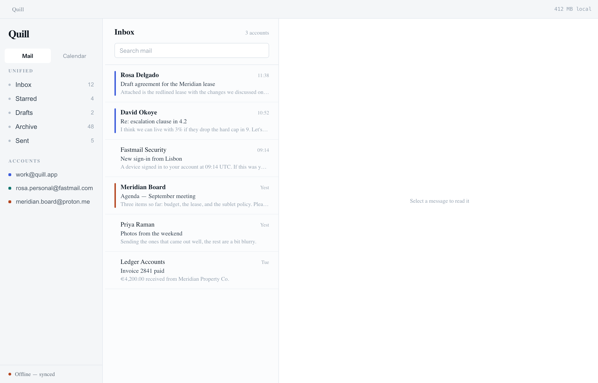
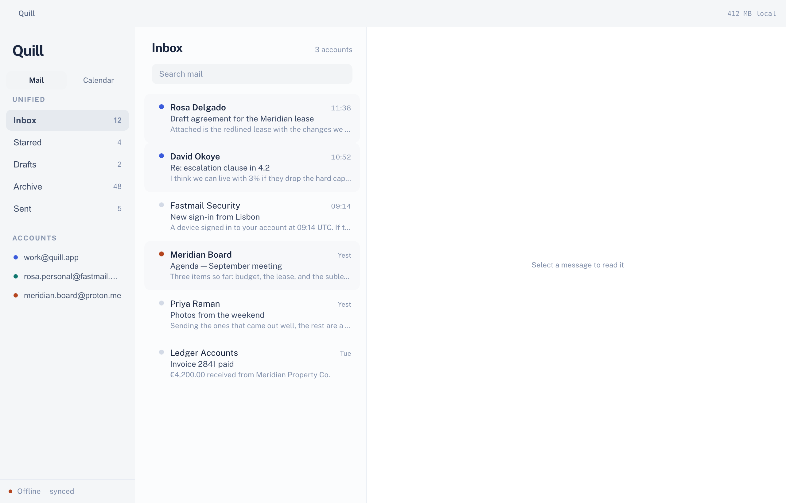
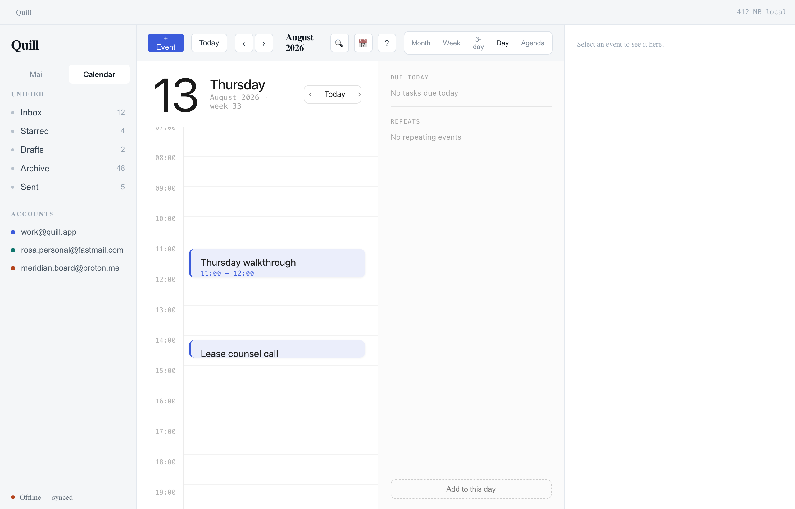
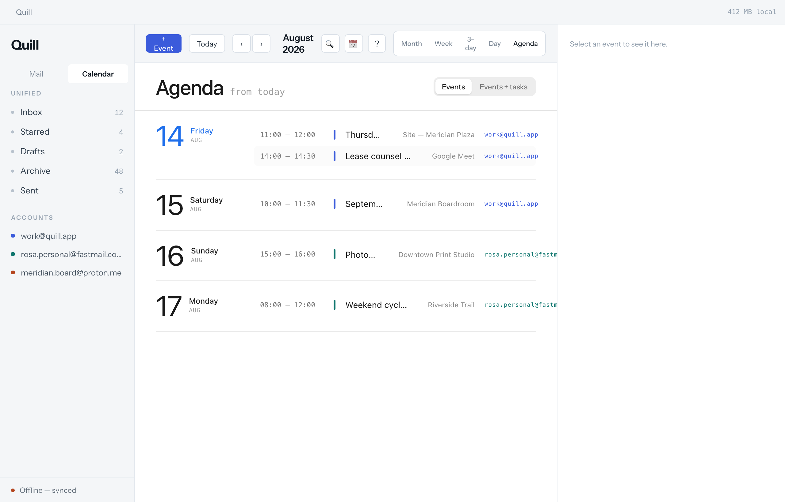
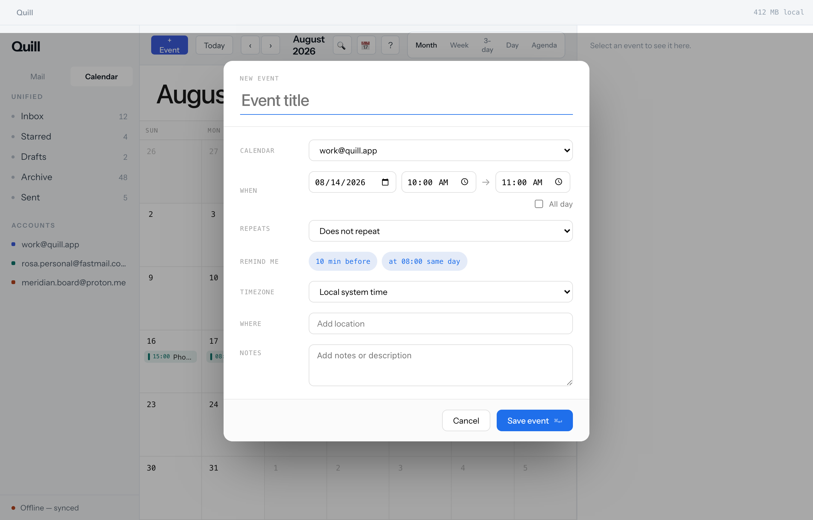
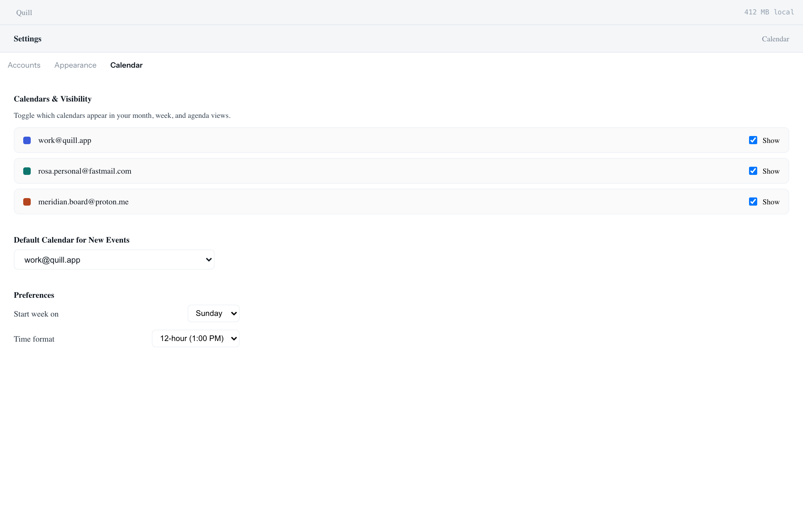
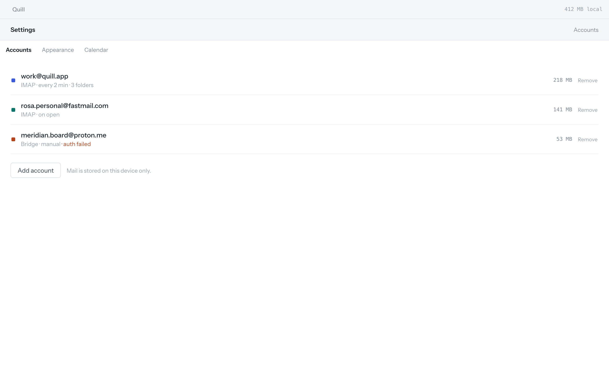

# Quill (rmail)

> A fast, lightweight, local-first desktop email and calendar client built with **Rust + Tauri v2** and **SolidJS + TypeScript**, integrating the embeddable **rcalendar** engine.

---

## 📸 Screenshots

### ✉️ Mail Client

#### 1. Three-Pane Inbox (Hairline Theme)



#### 2. Three-Pane Inbox (Banded Theme)



---

### 📅 Calendar Views (Powered by rcalendar)

#### Month View


#### Week View (Time Grid & Drag/Resize)


#### 3-Day View


#### Day View & Timeline



#### Agenda View



#### Event Editor Modal



---

### ⚙️ Settings & Preferences

#### Calendar Visibility & Preferences



#### Accounts Management



---

## ✨ Features

- **Local-First & Offline-Ready**: SQLite storage backend with instantaneous search, local cache footprint monitoring, and zero-latency UI interactions.
- **Integrated Calendar Engine (`rcalendar`)**:
  - Month, Week, 3-Day, Day, and Agenda views.
  - Recurrence expansion (RRULE, EXDATE, frequency rules, scoped updates).
  - Drag-and-drop event creation, time rescheduling, and duration resizing.
  - iCalendar (`.ics`) import and export.
  - Multi-calendar visibility and account color assignment.
- **Dual Visual Treatments**:
  - **Hairline**: Ultra-crisp borders, neutral surface tones, and high information density.
  - **Banded**: Soft surfaces, contextual pills, and rounded card elevations.
- **Unified & Multi-Account Email**: Multi-protocol support (IMAP / SMTP / Bridge), real-time push events, thread navigation, and secure credential handling via OS keychain.
- **Keyboard-First Navigation**:
  - `j` / `k` or `↑` / `↓`: Message navigation.
  - `Enter` / `Esc`: Focused reading mode toggle.
  - `/`: Search messages & events.
  - `Cmd + ,`: Settings.
  - `Shift + T` (Dev): Instant theme cycling.
  - `T`: Jump to today in calendar.

---

## 🏗️ Architecture

```
rmail/
├── src-tauri/             # Tauri v2 Desktop App Shell
├── crates/
│   ├── quill-store/       # SQLite persistence, migrations, domain models & demo seeds
│   ├── quill-mail/        # IMAP / SMTP network layer & keychain integration
│   └── quill-cal/         # CalDAV & iCal domain binding
├── rcalendar/             # Embeddable Calendar Engine & UI Library
│   ├── crates/
│   │   └── calendar-core/ # Pure Rust date math, RRULE engine & store traits (no Tauri/SQLite)
│   └── packages/
│       └── calendar-ui/   # Framework-agnostic SolidJS calendar views & modal components
├── src/                   # SolidJS frontend application
│   ├── components/        # Mail, Calendar, Settings, Titlebar, and Composer UI
│   ├── lib/               # IPC adapters, theme engine, keymaps, and store event listeners
│   └── styles/            # Strict token system (tokens.css)
└── docs/                  # Documentation & screenshots
```

---

## 🚀 Getting Started

### Prerequisites

- **Rust** (stable, 1.85+)
- **Node.js** (v22+) and **pnpm** (v11+)
- **Tauri Prerequisites** (Xcode command line tools on macOS, webkit2gtk on Linux)

### Installation & Run

```sh
# 1. Install dependencies
pnpm install

# 2. Run in development mode (Rust + Tauri + Vite with Hot Module Reload)
pnpm tauri dev

# 3. Or run the web preview standalone (with rich mock fallback)
pnpm dev
```

**Dev credential store:** `tauri dev` (debug builds) store account passwords and
OAuth tokens in a plaintext file at `~/Library/Application Support/quill/dev-credentials.json`
instead of the OS keychain, so macOS doesn't re-prompt for keychain access on every
rebuild. Existing keychain credentials migrate into that file on first read. Set
`QUILL_USE_KEYCHAIN=1` to force the real keychain in dev, or `QUILL_CREDENTIALS_FILE=/path`
to relocate the dev file.

### Running Tests & Quality Checks

```sh
# Run Rust workspace tests (calendar-core, quill-store, quill-cal)
cargo test --workspace

# Run TypeScript typechecks
pnpm run typecheck

# Run ESLint (Solid conventions & reactivity check)
pnpm run lint

# Run Stylelint (zero raw pixel / hex token enforcement)
pnpm run lint:css

# Full build verification
pnpm run build
```

---

## 📄 License

MIT License.
